# Flight Delay Analysis — U.S. Domestic Aviation (2019–2023)

Predictive analytics on 3 million BTS flight records to identify what drives U.S. domestic delays and whether delay likelihood can be predicted from pre-flight schedule data alone.

  [](LICENSE)

---

## Results at a glance

| Metric | Value |
|---|---|
| Flights analyzed | 2,913,804 (after removing cancellations/diversions) |
| Delay rate (>15 min) | 17.5% |
| Average departure delay | 10.1 minutes |
| Top delay cause | Late Aircraft — 41.1% of total delay minutes |
| Peak delay month | June (22.6% delay rate) |
| Worst departure hour | 21:00 (27.5% delay rate) |
| Best departure hour | 05:00 (6.9% delay rate) |
| Logistic Regression accuracy | 59.2% |
| Decision Tree accuracy | 57.9% |
| Cancellation rate | 2.64% overall; 6.00% in 2020 (COVID) |

---

## Dataset

**Source:** Bureau of Transportation Statistics — Airline On-Time Performance Data  
**Kaggle:** [patrickzel/flight-delay-and-cancellation-dataset-2019-2023](https://www.kaggle.com/datasets/patrickzel/flight-delay-and-cancellation-dataset-2019-2023)

| Property | Value |
|---|---|
| File | `flights_sample_3m.csv` |
| Rows | 3,000,000 |
| Columns | 32 |
| Date range | 2019-01-01 to 2023-08-31 |
| Key fields | FL_DATE, AIRLINE, ORIGIN, DEST, DEP_DELAY, ARR_DELAY, CANCELLED, CARRIER_DELAY, WEATHER_DELAY, NAS_DELAY, SECURITY_DELAY, LATE_AIRCRAFT_DELAY |

The CSV is not committed to this repo (614 MB). Download it from Kaggle and place it in `data/`.

---

## Architecture

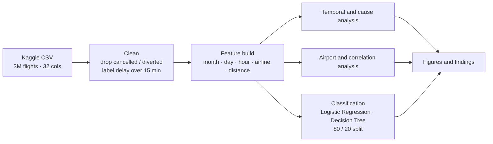

- **Clean** — the 3M-row sample is stripped of cancelled/diverted flights, with a binary label at the 15-minute threshold.
- **Analyse** — year/season/hour trends, delay-cause breakdown, and the 20 most-delayed airports.
- **Model** — class-weighted Logistic Regression and Decision Tree on an 80/20 split.

## Methods

- **Data cleaning:** removed cancelled and diverted flights; binary delay label at >15 min threshold
- **Temporal analysis:** year-over-year trends, monthly seasonality, day-of-week, hour-of-day
- **Cause analysis:** breakdown of carrier, weather, NAS, security, and late aircraft delay minutes
- **Airport analysis:** top 20 most-delayed departure airports (min. 5,000 flights)
- **Correlation:** heatmap across all delay variables and distance
- **Classification:** Logistic Regression and Decision Tree with `class_weight='balanced'` (80/20 split, 2,331,043 train / 582,761 test)
- **Features:** MONTH, DAY_OF_WEEK, DEP_HOUR, AIRLINE (label encoded), DISTANCE

---

## Figures

| Figure | Description |
|---|---|
| 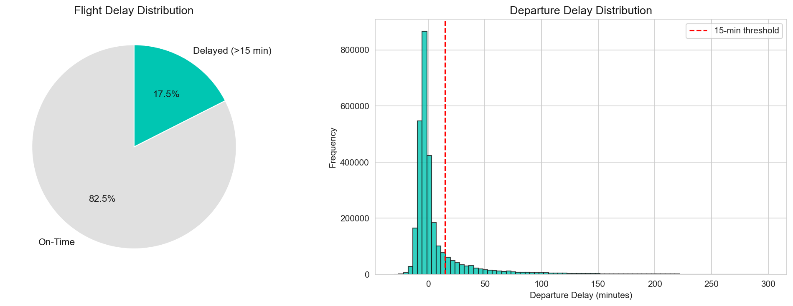 | Delay distribution — pie chart + departure delay histogram |
| 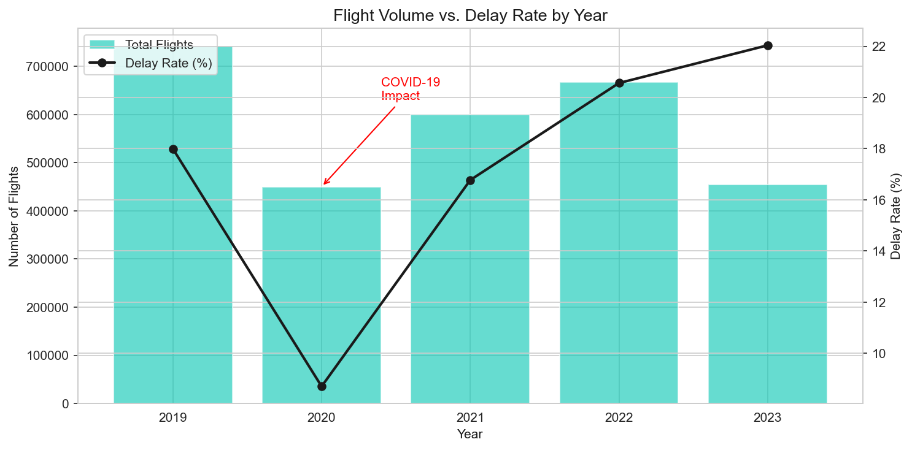 | Year-over-year: total flights vs delay rate (COVID annotated) |
| 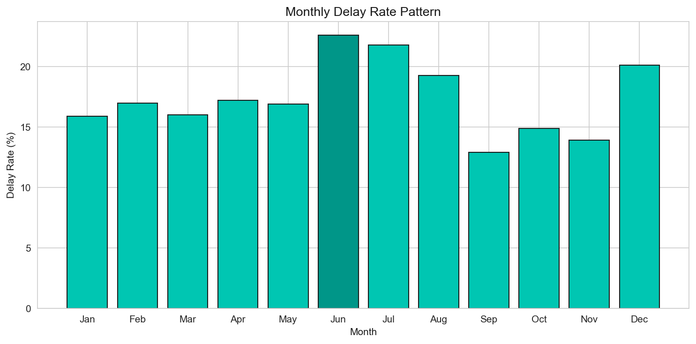 | Monthly delay rates — June peak highlighted |
| 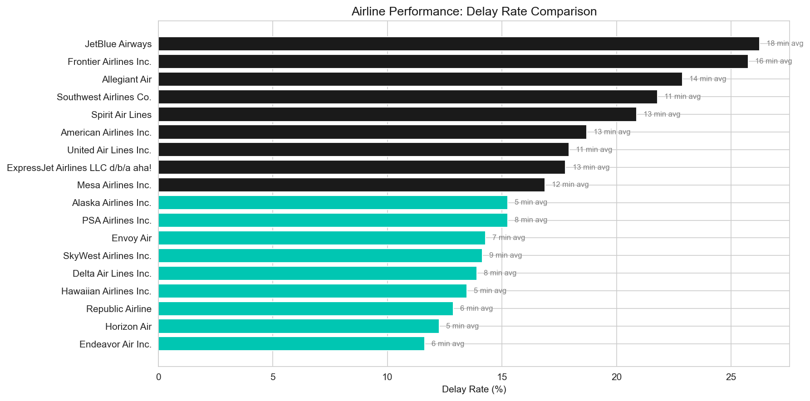 | Airline delay rate comparison (horizontal bar) |
| 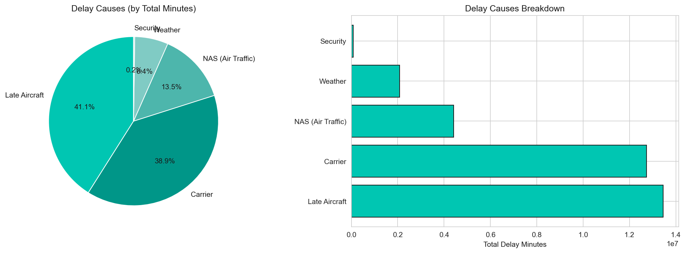 | Delay cause breakdown by total minutes |
| 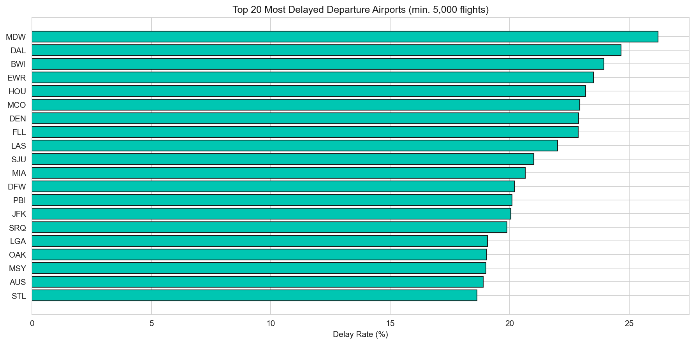 | Top 20 most-delayed departure airports |
| 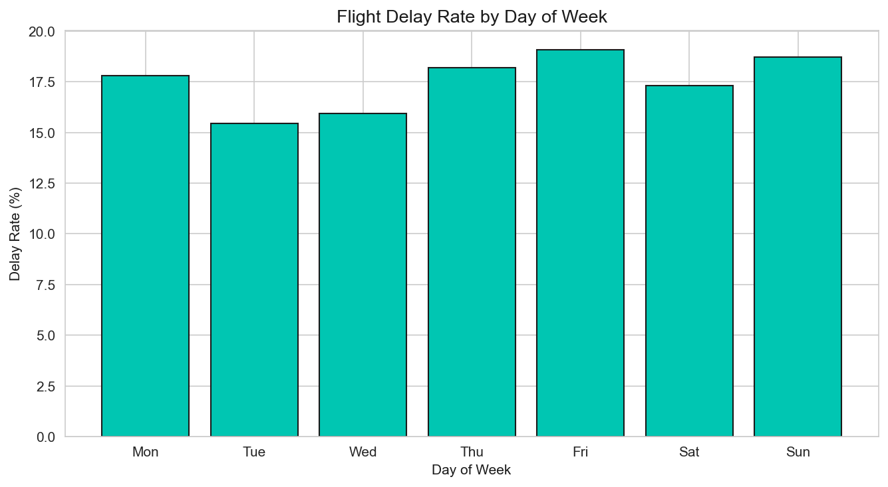 | Delay rate by day of week |
| 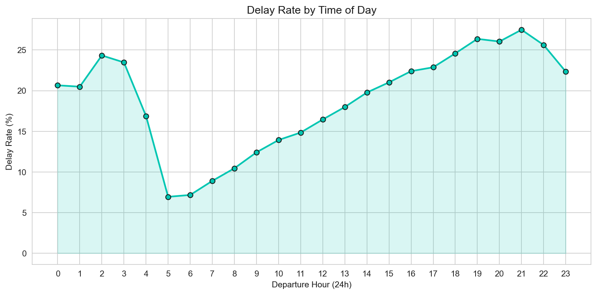 | Delay rate by hour of day |
| 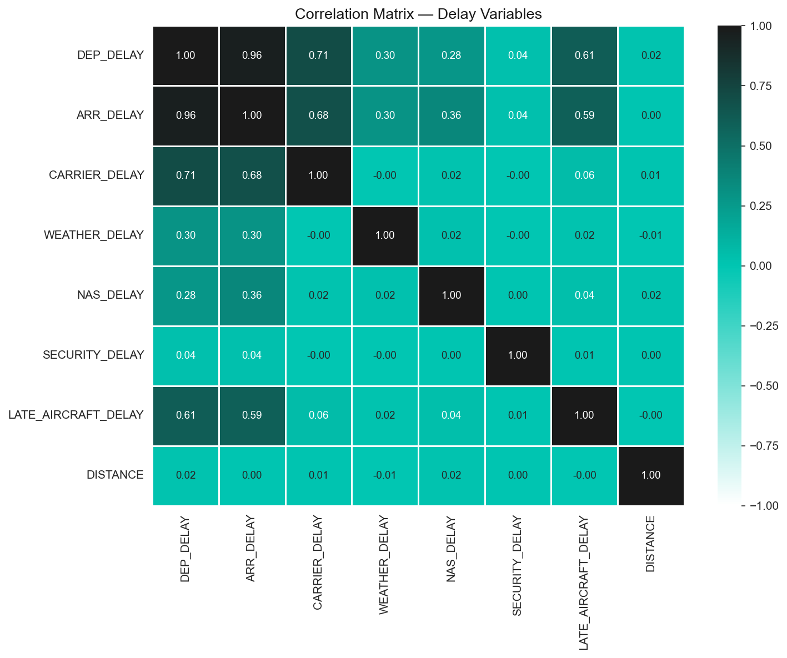 | Correlation matrix — delay variables |
| 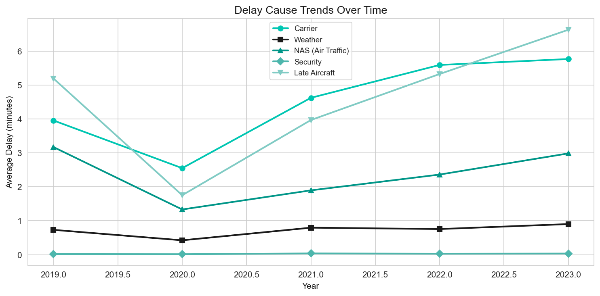 | Delay cause trends over time (2019–2023) |
| 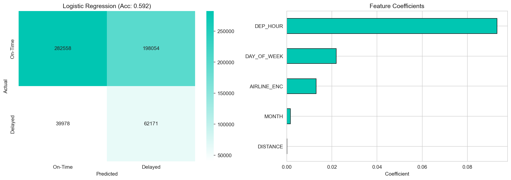 | Logistic Regression — confusion matrix + feature coefficients |
| 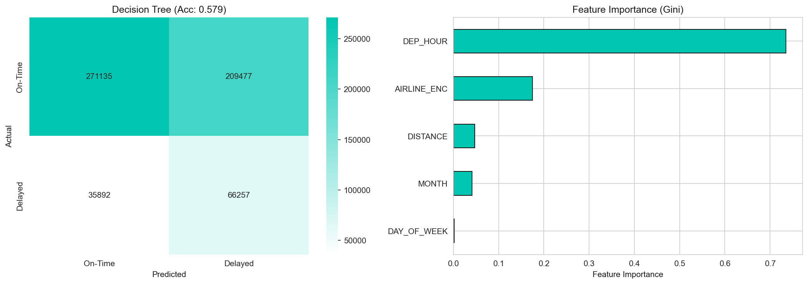 | Decision Tree — confusion matrix + feature importances |
| 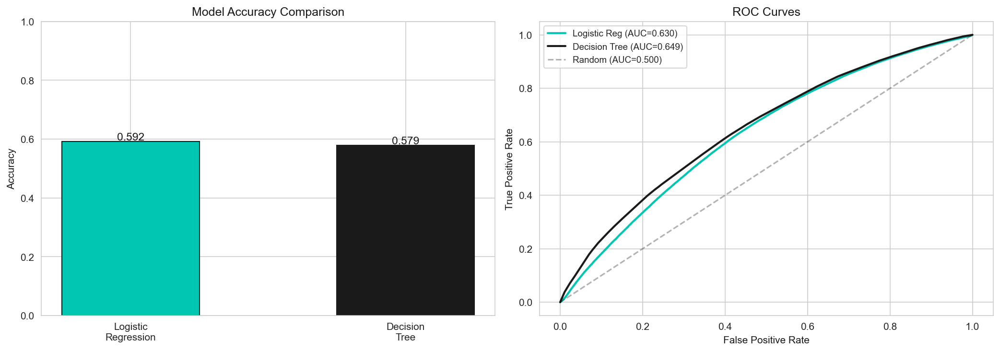 | Model accuracy comparison + ROC curves |

---

## Key findings

**Late Aircraft is the biggest controllable problem.** It accounts for 41.1% of total delay minutes across 2.91 million flights — more than carrier, weather, NAS, and security combined. Since late aircraft delays cascade from earlier flights in the same rotation, schedule buffers during peak hours can break the chain before it propagates.

**Delays are predictable by time, not just random.** The 21:00 departure hour has a 27.5% delay rate; 05:00 has 6.9%. June has a 22.6% delay rate. Both are known before a passenger arrives at the airport — which is what makes pre-flight early-warning systems viable.

**Models are modest but honest.** Logistic Regression hit 59.2% accuracy and Decision Tree 57.9%, using only pre-flight schedule features. Recall on the Delayed class was 0.61 (LR) and 0.65 (DT) — meaning the models catch a majority of actual delays. Adding real-time weather, crew data, and inbound aircraft status would likely push this substantially higher.

---

## Business recommendations

1. Increase schedule buffer time during 14:00–20:00 and June–August to reduce cascade delays.
2. Pre-position backup aircraft at chronically delayed airports to break the late aircraft chain.
3. Scale ground crew for June, July, August, and December when delay rates spike.
4. Price early-morning flights to shift demand toward the 05:00–08:00 window.
5. Deploy the classification model as a 24-hour early-warning flag for high-risk rotations.

---

## Reproduce

```bash
git clone https://github.com/kandulanikhilvarma/flight-delay-analysis
cd flight-delay-analysis

pip install -r requirements.txt

# Download data from Kaggle and place in data/
# then:
jupyter notebook flight_delay_analysis.ipynb
```
---

## Data & Attribution

The underlying on-time performance data is published by the U.S. **Bureau of
Transportation Statistics** (U.S. Department of Transportation) and, as a work of
the U.S. federal government, is in the **public domain**. The packaged 3M-row
sample used here was redistributed on Kaggle by *patrickzel*.

Analysis code and figures in this repository are released under the MIT License
(see [LICENSE](LICENSE)); the source data remains under its original terms.

---

## References

- Bureau of Transportation Statistics (2024). *Airline On-Time Performance Data*. U.S. Department of Transportation. https://www.transtats.bts.gov/
- Patrickzel (2023). *Flight Delay and Cancellation Dataset (2019–2023)*. Kaggle. https://www.kaggle.com/datasets/patrickzel/flight-delay-and-cancellation-dataset-2019-2023
- Federal Aviation Administration (2024). *Air Traffic By The Numbers*. https://www.faa.gov/air_traffic/by_the_numbers
- Airlines for America (2024). *Annual Results: U.S. Airlines*. https://www.airlines.org/dataset/annual-results-u-s-airlines/

---

## License

Released under the MIT License — see [LICENSE](LICENSE). The source flight data remains under its original terms (see **Data & Attribution** above).

---

**Nikhilvarma Kandula** — Data Science · NLP · Statistical Analysis  
[LinkedIn](https://www.linkedin.com/in/nikhilvarmakandula) · [Email](mailto:kandulanikhilvarma@gmail.com) · [Portfolio](https://kandula.studio)
